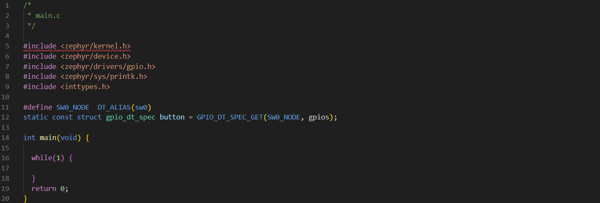
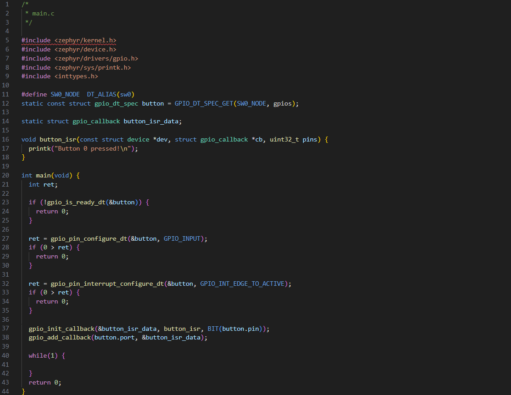
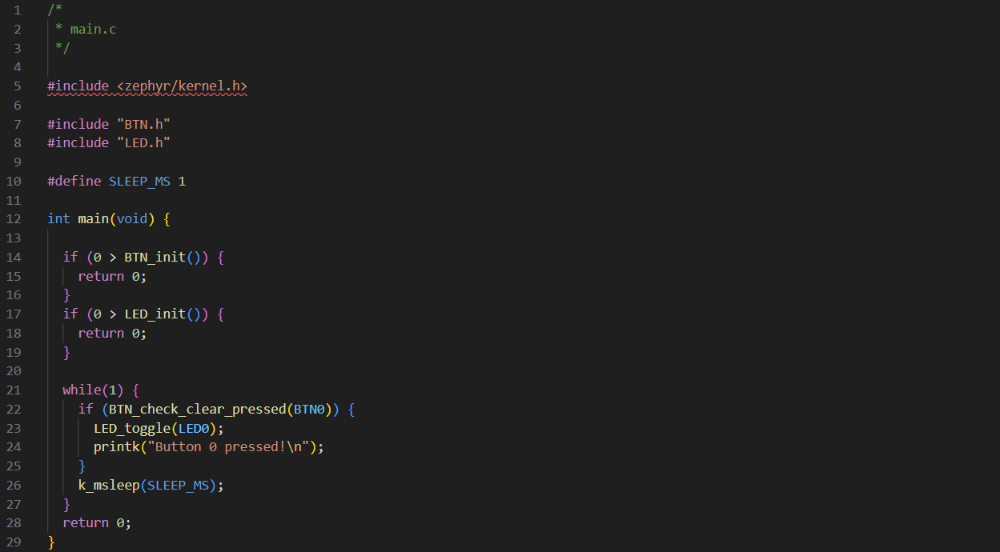

# Debug and Buttons

## Table of Contents
- [Debug and Buttons](#debug-and-buttons)
  - [Table of Contents](#table-of-contents)
  - [Introduction](#introduction)
  - [Serial debugging](#serial-debugging)
    - [How does it work?](#how-does-it-work)
    - [Installing and using the VSCode serial monitor](#installing-and-using-the-vscode-serial-monitor)
    - [How to use it](#how-to-use-it)
  - [Buttons](#buttons)
    - [How do you use a button?](#how-do-you-use-a-button)
  - [Lesson](#lesson)
    - [Basic gpio reading on Zephyr](#basic-gpio-reading-on-zephyr)
    - [Using interrupts on Zephyr](#using-interrupts-on-zephyr)
    - [Button bouncing](#button-bouncing)
    - [EiE Button APIs](#eie-button-apis)
    - [EiE LED APIs](#eie-led-apis)
      - [Example program:](#example-program)
  - [Exercises](#exercises)

## Introduction

This lesson aims to cover two key topics of embedded systems: debugging via serial interface, and
using buttons. Both these topics are crucial, and you'll probably find yourself using them in some
way or another for every future lesson!

## Serial debugging

Debugging with a serial monitor is the embedded systems equivalent to having print statements
throughout your code, and can make otherwise incredibly difficult-to-understand bugs quite easy to
diagnose.

Some examples of where you may want to use a print statement:
- To see what point the program is getting to before it crashes/something goes wrong
- To see how often your program has to recover from a bad state
- To see how often your code has to react to an interrupt
- To check that it's doing internal processing as expected

### How does it work?

For now, our system involves sending data in one direction only. so there are two endpoints to
consider when working with our serial interface:
1. **The transmitter** (your development board in this case):
   Responsible for sending data to a receiver. Note that "transmit"/"transmitter" is commonly
   abbreviated to "Tx".
1. **The receiver** (your computer in this case):
   Responsible for listening to incoming data from a transmitter. Note that "receive"/"receiver" is
   commonly abbreviated to "Rx".

It's called a "serial" interface because it sends data in serial: one bit after another in a strict
order (note that this is where USB gets its name: Universal Serial Bus).

Now you might be asking: "how do words get converted to bits?" The answer: *ASCII* (*for the most part)

ASCII (American Standard Code for Information Interchange) is an encoding standard for converting
numbers, Latin alphabet letters and other common symbols to binary, here's a handy table:


(Table from ZZT32 and is in the public domain)

When you use a debug print statement with a serial interface, it converts the text you give to
binary and transmits it in order to the receiver, who then decodes it back to text using the same
standard and displays it to a *serial monitor*. A serial monitor is a program that runs on your
computer and displays incoming serial data from a specific port.

### Installing and using the VSCode serial monitor

All serial monitors effectively do the same thing, so you're welcome to use any serial monitor you
like if you already have a preference. Otherwise, it's recommended you follow these steps to use our
recommended serial monitor:
1. Open VSCode and click the "Extensions" menu in the left sidebar
2. Search "@recommended" and make sure "Serial Monitor" by Microsoft is installed, if you don't see it, procede to step 3
3. Search "Serial Monitor" and install the extension by Microsoft
   
4. Open the terminal by hovering your mouse near the bottom of VSCode and pulling up once you see
   the arrow. Alternatively, select the three dots at the top-left of VSCode click
   "Terminal">"New Terminal" and in the tabs select "SERIAL MONITOR"
5. Note you may need to restart VSCode or restart extensions to be able to see it as an option

### How to use it

As a brief note: on Zephyr, there are two options for serial printing:
1. printf:
   A standard library function that supports many formatting options, but has a large memory
   footprint. Included in <stdio.h>
2. printk:
   An operating system (kernal) function that only allows basic formatting, but is much more
   lightweight. Included in <zephyr/sys/printk.h>
We'll typically recommend using printk.

A typical debug statement might look something like:
```c
printk("foo got bar as: %d", bar);
```

## Buttons

Buttons are one of the core ways to get input from a user, and are one of the most basic ways a user
can interact with any computer based system.

### How do you use a button?

Similar to LEDs, to use a button you first need to:
1. Initialize it:
   This involves using the buttons' device tree identifier to fetch key information
   to populate a gpio_dt_spec struct representing the button
2. Configure it:
   This involves setting the characteristics of how you want the button to behave during the
   program, including any interrupt settings (explained below).

When it comes to checking if a button is/has been pressed, there are two paradigms:
1. Polling:
   The simple solution. This involves periodically checking whether or not a button is being
   pressed. This is sometimes all you need, but the problem is that you can easily miss events and
   that you constantly have to read the button input. To use a metaphor, this is like putting a pie
   into the oven, and then having to come back to check the oven every few minutes to see if it's
   done cooking yet.
2. Interrupts:
   The robust solution. This involves writing a special function that gets called when an event
   (you get to decide what kind of event) occurs to the button. This "interrupt function" is called
   an *Interrupt Service Routine* (ISR). When the event you specified occurs, the processor will
   stop whatever it is doing and go execute the associated ISR. Interrupts are crucial for embedded
   systems, as they allow them to respond to random events without wasting processing power by
   always being active and reading an input. With an interrupt-based program, you can put the
   processor to sleep, and only do work when an interrupt is triggered, which would cause the
   processor to wake up so it can handle the event. To extend the previous metaphor, this is like
   putting a pie into the oven and then setting a timer - you can go do whatever you want without
   needing to constantly check the pie, and then when it's done you get alerted and can go deal
   with it.

## Lesson

As an aside before we get too far into the lesson: a helpful thing to know about Zephyr is that
negative return values are typically used to convey error codes.

### Basic gpio reading on Zephyr

1. Go to app/src/main.c, you'll notice there are a few libraries included that will be helpful for
   this lesson, but that the main function is otherwise empty.
   
   - <zephyr/kernel.h> includes kernel functions like k_msleep
   - <zephyr/device.h> includes the device struct used in gpio_dt_spec
   - <zephyr/drivers/gpio.h> includes all the gpio_* functions and types
     - Note: * is called a "glob" and in this case denotes all names/symbols starting with
       "gpio_"
   - <zephyr/sys/printk.h> includes the printk function
   - <inttypes.h> includes fixed sized integer types like uint8_t and sint32_t
2. Start by initializing the `gpio_dt_spec` struct for button 0 from the device tree
   
   Remember that this is going to the device tree (the abstraction layer that maps boards to the
   peripherals they actually support) and initializing a gpio_dt_spec struct from what it finds
   there.
3. Next, configure the button variable you just got in step 2. Remember you first need to check if
   the port is ready to be configured:
   
   - Note: when checking the return value from gpio_pin_configure_dt, the order of
     arguments are reversed from what you're probably used to: `ret < 0` vs `0 > ret`. This is sometimes called
     "Yoda notation" and it prevents accidental assignment instead of comparison. For example, if
     you wanted to check if `my_int` is equal to 5, you might use `if (my_int == 5) { /* do thing */ }`,
     but what if you forget the second equal sign, and type `if (my_int = 5) { /* do thing */ }` instead?
     What would happen is that the assignment of 5 to `my_int` always evaluates to true, and the
     contents of the if block are always executed - even when `my_int` wasn't equal to 5! Now, if
     you swap the order and instead use `if (5 == my_int) { /* do thing */ }` as a habit, whenever
     you accidentally forget the second equals sign (`if (5 = my_int) { /* do thing */ }`), you'll
     get a compiler error instead! It's always good practice in programming to try to fail as early as
     possible, rather than having buggy code sitting and waiting to make something fail when you
     least expect it.
4. Now you can use `gpio_pin_get_dt` to check the state of the button, and call printk when it's pressed!
   
5. Build and flash your board with the code you just created
   - *Remember: to build use* `west build -b nrf52840dk/nrf52840 app`, *to flash use* `west flash`
6. Open the serial monitor:
   - Select the COM port that your dev board is plugged into (it will say "JLink" in the port name)
   - Set the baud rate to 74880
   - Select "Start Monitoring"
     
   - Hold down the button on the dev board that says "BUTTON 1" (note that BUTTON 1 actually
     corresponds to button 0 in zephyr, BUTTON 2 corresponds to button 1 and so on)
7. Do you see anything odd?
   - The gibberish you see on the serial monitor means that it doesn't understand how to read the
     data it's getting
   - This is because in order for serial communication protocols to work, both sides (Tx and Rx)
     need to agree on the parameters of the communication, these are things like character encoding,
     parity and baud rate. Let's focus on baud rate: baud rate is how fast the communication
     is happening, for UART/USB it represents how many bits are transmited per second. If there is
     a disconnect between the baud rate the transmitter is transmitting at and the baud rate the
     receiver is sampling at, you'll see random characters like you just saw. To fix this, change
     the baud rate to 115200. Now you should see "Pressed!" every second the button is held. Note
     that 115200 is the default baud rate this board uses.

What method of button reading was used here?

**Before continuing, make sure you understand the previous example**

### Using interrupts on Zephyr

Let's make a program that prints something to the console whenever the interrupt is triggered:

1. Start by making a function that you want to be called when your interrupt is triggered (button_isr in this example):
   
   - You may be wondering why I chose such "random" parameters for the ISR, I used these parameters
     because they match the function signature Zephyr is expecting for an interrupt service routine.
     Remember that C is a statically typed language, so Zephyr is constrained to only allow functions
     that exactly match that signature to be used (otherwise it won't even compile!). Lucky for us,
     these parameters can be really useful for writing our ISR. The device struct pointer is the GPIO
     port device that triggered the interrupt, and the pins parameter is a bitmask of the pin that
     (on the port specified by the device pointer) triggered the interrupt. The gpio_callback struct
     is useful for bundling relevant callback data and it even allows you to pass data into the
     interrupt using some special macros, but we won't worry about all that for now.
      - Note: a bitmask is a special binary integer encoding that assigns each bit of an integer
        a special meaning. In this case, it means that each pin on the given port is given a specific
        bit in the "pins" parameter, and we can check which bit is set (== 1) to see which pin
        caused the interrupt. Bitmasks are used to tightly pack information into an integer format,
        but note that bitmasks shouldn't be interpreted as a number, but as a bundle of individual flags.
2. Now allocate a static gpio_callback struct instance that will hold the callback data for your
   interrupt and configure and init your interrupt:
   
   - Here, we're configuring the button to trigger an interrupt when the button transitions from being
     not pressed to being pressed (AKA a "rising edge" interrupt), and we're passing the ISR function
     we defined to the gpio_init_callback function so it can store it internally and call it when
     the interrupt is triggered.
   - Note: "callback" refers to a function that gets passed somewhere within the program and called
     at a later point (because in C, you can pass around pointers to functions), in this case it means
     the same thing as an interrupt service routine.
   - Note that because our program is interrupt based, we don't even need anything in the main loop as our
     code will be executed every time an interrupt event occurs!
3. Build and flash your board with the program and connect it to the serial monitor.
4. Now click the button 15 times and count how many times you see "Button 0 pressed!" printed to the console.
   Is this what you expected?

The program isn't malfunctioning, in fact it's doing exactly what you told it to, so why do some button clicks
cause multiple print statements?

### Button bouncing

Unfortunately, buttons aren't perfect and the metal contacts inside of them aren't exactly flat. Because of this,
when you click a button, the metal contacts "bounce" very quickly several times before they make consistent contact.
Using an oscilloscope, we can see exactly what this looks like:

(Image from: https://hackaday.com/2015/12/09/embed-with-elliot-debounce-your-noisy-buttons-part-i/ which is an
  excellent source on button bouncing and how to debounce.)

Notice how the button voltage (high == on, low == off) jumps several times before it ever stabilizes? This is
what's causing our problem with seeing multiple print statements each time it's clicked! Sometimes the jumps
are high enough that they cross the voltage threshold needed to count as an "edge to active" and trigger
the interrupt, but sometimes they don't, and that's why you only it only prints multiple times *sometimes*.

There's lots of ways you can fix this, but the simplest way boils down to a debounce delay, here's how it works:
The button gets clicked and bounces, when the first edge to active is hit interrupts get disabled for some
debounce delay (typically between 10 - 50ms). After the delay is over, they get turned back on, and the state of
the button is checked, if it's high at that point (i.e. the button is pressed) then this counts as a single
click, and a flag is set somewhere in your program. The strategy here is to wait out the initial instability
and then check once things have stabilized. Different buttons have different bouncing durations, so it's
important to keep that in mind when writing a debouncing system.

Because debouncing buttons can be complicated, we'll provide you with some functions you can use
that handle debouncing internally. Usually, we refer to one or more functions that give you an
interface into a module as "APIs" or *Application Programmer Interfaces*.

### EiE Button APIs

Here's a rundown of how the APIs we'll provide work:

1. To use the button APIs, you need to include "BTN.h" in your main.c file
   - Note that here, capital letters in the header name indicate this is a "public" header, and that
     you can use the functions and types declared there freely. You'll notice the implementation file
     is called "btn.c", this is because it's intended to be private to enfore encapsulation (modularity).
     A "private" function is one that you aren't supposed to use since it's not made to be called outside
     a very specific context.
2. You then need to initialize the button module by calling `BTN_init` somewhere before your main loop,
   you also need to check the return value of `BTN_init` in the event that it failed (remember that
   error codes are negative by convention on Zephyr)
3. In your program, there are 4 APIs you can call:
    - `bool BTN_is_pressed(btn_id btn)`: Returns true if the given button is currently being pressed
    - `bool BTN_check_clear_pressed(btn_id btn)`: Returns true if the given button has been pressed since you last checked
      its internal flag, clears the internal flag upon returning
    - `bool BTN_check_pressed(btn_id btn)`: Returns true if the given button has been pressed since you last checked
      its internal flag, does not clear the internal flag upon returning
    - `void BTN_clear_pressed(btn_id btn)`: Returns nothing, clears the internal state flag of the given button
  You pick which button to pass these functions by using `BTNx` where x is the button number (0 - 3 on nRF52840dk)

`BTN_check_pressed` and `BTN_clear_pressed` are provided to give you more flexibility, but in most
cases you will find that using either `BTN_is_pressed` or `BTN_check_clear_pressed` will be all that you need.

We wanted you to get a hands-on experience using the buttons as a raw gpio_dt_spec with the
Zephyr gpio APIs before we gave you our advanced APIs that handle all the complexity internally. This
is because it's crucial to understanding how buttons are handled at a (somewhat) low level. However
from now on you can use the simplified APIs that we provide.

### EiE LED APIs

In addition to the simpler button APIs, we'll also provide a simplified LED API:

1. To use LED APIs, you need to include "LED.h" in your main.c file (not the same public/private naming convention)
2. You then need to initialize the LED module by calling `LED_init`, also remembering to check the return value
   in case something failed
3. In your program, there are 3 APIs you can call:
    - `int LED_toggle(led_id led)`: Returns 0 on success, toggles the given LED's state
    - `int LED_set(led_id led, led_state new_state)`: Returns 0 on success, sets the given LED's state to new_state
      (new_state can be either LED_ON or LED_OFF)
    - `void LED_blink(led_id led, led_frequency frequency)`: No return value, starts blinking the given LED
      at the specified frequency (LED_1HZ, LED_2HZ, LED_4HZ, LED_8HZ, LED_16HZ). This is a non-blocking function,
      meaning it returns immediately and handles blinking the LED separately.
  You pick which LED to pass these functions by using `LEDx` where x is the LED number (0 - 3 on nRF52840dk)

#### Example program:

Here is an example program:

Before running it, can you see what this program will do?
Build this and flash it to your board. Now click the button 15 times and count how many times
"Button 0 pressed!" got printed, do you still see bouncing?

## Exercises

Create seperate git commits for each part of the exercise, once you're done this lesson push
your changes to the debug_buttons branch of your repository.

- Create a 4 bit binary counter using all 4 LEDs. An LED being off should represent a binary 0,
  and an LED being on should represent a binary 1. The internal counter should increment each time
  BTN0 is pressed. The LEDs should reset once the internal counter reaches 16.

**Challenge:**
1. Create a password system that uses BTN0, BTN1, BTN2 as inputs, and BTN3 as the "enter" button.
   The program should start in a locked state with LED0 turned on. The user should be able to click
   a combination of BTN0, BTN1, BTN2 (that you choose at compile time) as the passkey entry stage.
   Once the user clicks BTN3, "Correct!" should be printed if the password was correct, and "Incorrect!"
   should be printed if the password was wrong. After the user entered their password with BTN3, LED0
   should turn off and your program should enter a "waiting" state. The user should be able to press
   any button to reset the program back to its locked state while it's in the waiting state, and the
   program should reset.

2. When the board starts, turn LED3 on for 3 seconds. During those 3 seconds, the user should be able
   to click BTN3, which puts the program into an "entry" mode until BTN3 is clicked again. The user should be
   able to enter a password of their choice by entering a sequence of BTN0, BTN1, BTN2. Once they click BTN3,
   the password should be saved, and the program should enter the locked state, where it should function the
   same way as part 1 of this exercise.
