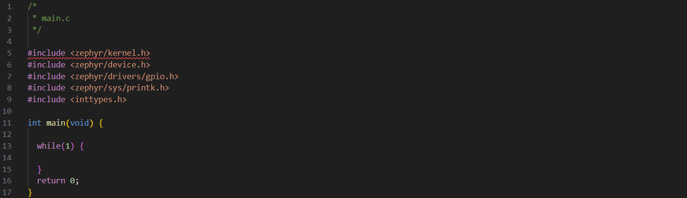
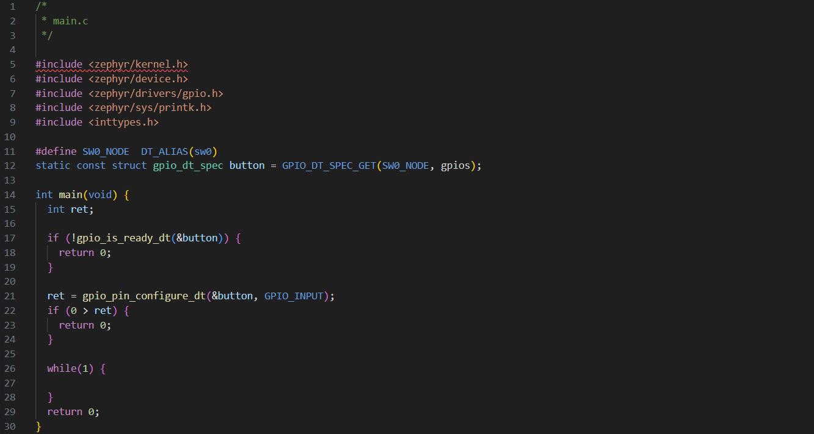
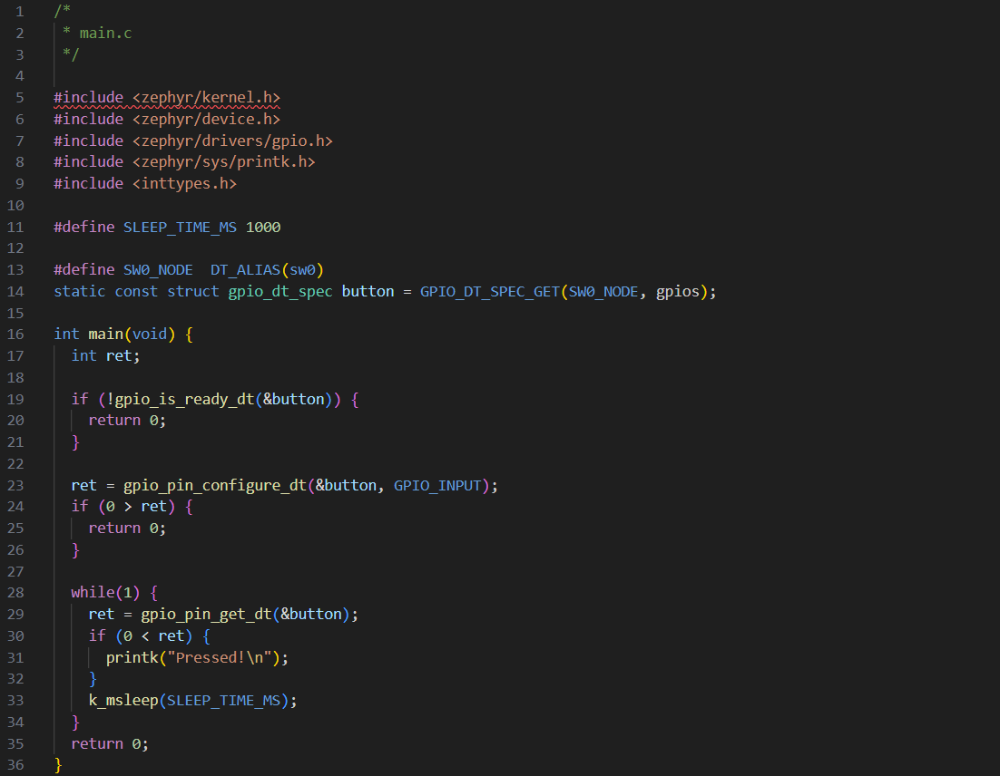

# Debug and Buttons

## Table of Contents
- [Debug and Buttons](#debug-and-buttons)
  - [Table of Contents](#table-of-contents)
  - [Introduction](#introduction)
  - [Serial debugging](#serial-debugging)
    - [How does it work?](#how-does-it-work)
    - [Installing and using the VSCode serial monitor](#installing-and-using-the-vscode-serial-monitor)
    - [How to use it](#how-to-use-it)
  - [Buttons](#buttons)
    - [How do we use a button?](#how-do-we-use-a-button)
  - [Lesson](#lesson)

## Introduction

This lesson aims to cover two key topics of embedded systems: debugging via serial interface, and
using buttons. Both these topics are crucial, and you'll probably find yourself using them in some 
way or another for every future lesson!

## Serial debugging

Debugging with a serial monitor is the embedded systems equivalent to having print statements
throughout your code, and can make otherwise incredibly difficult-to-understand bugs quite easy to
diagnose. 

Some examples of where you may want to use a print statement:
- To see what point the program is getting to before it crashes/something goes wrong
- To see how often your program has to recover from a bad state
- To see how often your code has to react to an interrupt
- To check that it's doing internal processing as expected

### How does it work?

For now, our system involves sending data in one direction only. so there are two endpoints to
consider when working with our serial interface:
1. **The transmitter** (your development board in this case):  
   Responsible for sending data to a receiver. Note that "transmit"/"transmitter" is commonly 
   abbreviated to "Tx".
1. **The receiver** (your computer in this case):  
   Responsible for listening to incoming data from a transmitter. Note that "receive"/"receiver" is
   commonly abbreviated to "Rx".
   
We call it a "serial" interface because it sends data in serial: one bit after another in a strict
order (note that this is where USB gets its name: Universal Serial Bus).

Now you might be asking: "how do words get converted to bits?" The answer: *ASCII* (*for the most part)

ASCII (American Standard Code for Information Interchange) is an encoding standard for converting
numbers, Latin alphabet letters and other common symbols to binary, here's a handy table:


When you using a debug print statement with a serial interface, it converts the text you give to
binary and transmits it in order to the receiver, who then decodes it back to text using the same
standard and displays it to a *serial monitor*. A serial monitor is a program that runs on your
computer and displays incoming serial data from a specific port. 

### Installing and using the VSCode serial monitor

All serial monitors effectively do the same thing, so you're welcome to use any serial monitor you
like if you already have a preference. Otherwise, we recommend you follow these steps to use our
recommended serial monitor:
1. Open VSCode and click the "Extensions" menu in the left sidebar
2. Search "Serial Monitor" and install the extension by Microsoft  
   
3. Open the terminal by hovering your mouse near the bottom of VSCode and pulling up once you see
   the arrow. Alternatively, select the three dots at the top-left of VSCode click 
   "Terminal">"New Terminal"

### How to use it

As a brief note: on Zephyr, there are two options for serial printing:
1. printf:  
   A standard library function that supports many formatting options, but has a large memory
   footprint. Included in <stdio.h>
2. printk:  
   An operating system (kernal) function that only allows basic formatting, but is much more
   lightweight. Included in <zephyr/sys/printk.h>
We'll typically recommend using printk.

A typical debug statement might look something like:
```c
printk("foo got bar as: %d", bar);
```

## Buttons

Buttons are one of the core ways we get input from a user, and is one of the most basic ways a user
can interact with any computer based system.

### How do we use a button?

Similar to LEDs, to use a button you first need to:
1. Initialize it:  
   This involves using the buttons' device tree identifier to fetch key information
   to populate a gpio_dt_spec struct representing the button
2. Configure it:  
   This involves setting the characteristics of how you want the button to behave during the
   program, including any interrupt settings (explained below).
   
When it comes to checking if a button is/has been pressed, there are two paradigms:
1. Polling:  
   The simple solution. This involves periodically checking whether or not a button is being
   pressed. This is sometimes all you need, but the problem is that you can easily miss events and
   that you constantly have to read the button input. To use a metaphor, this is like putting a pie
   into the oven, and then having to come back to check the oven every few minutes to see if it's
   done cooking yet. 
2. Interrupts:  
   The robust solution. This involves writing a special function that gets called when an event
   (you get to decide what kind of event) occurs to the button. This "interrupt function" is called
   an *Interrupt Service Routine* (ISR). When the event you specified occurs, the processor will
   stop whatever it is doing and go execute the associated ISR. Interrupts are crucial for embedded
   systems, as they allow them to respond to random events without wasting processing power by
   always being active and reading an input. With an interrupt-based program, we can put the
   processor to sleep, and only do work when an interrupt is triggered, which would caus the 
   processor to wake up so it can handle the event. To extend the previous metaphor, this is like
   putting a pie into the oven and then setting a timer - you can go do whatever you want without
   needing to constantly check the pie, and then when it's done you get alerted and can go deal
   with it.

## Lesson

Check out the `debug_buttons` branch:  
```bash
git fetch upstream
git checkout debug_buttons
```

As an aside before we get too far into the lesson: a helpful thing to know about Zephyr is that
negative return values are typically used to convey error codes.

1. Go to app/src/main.c, you'll notice there are a few libraries included that will be helpful for
   this lesson, but that the main function is otherwise empty. 
   
   - <zephyr/kernel.h> includes kernel functions like k_msleep
   - <zephyr/device.h> includes the device struct used in gpio_dt_spec
   - <zephyr/drivers/gpio.h> includes all the gpio_* functions and types 
     - Note: * is called a "glob" and in this case denotes all names/symbols starting with
       "gpio_"
   - <zephyr/sys/printk.h> includes the printk function
   - <stdint.h> includes fixed sized integer types like uint8_t and sint32_t
2. Start by initializing the `gpio_dt_spec` struct for button 0 from the device tree
   
   Remember that this is going to the device tree (the abstraction layer that maps boards to the
   peripherals they actually support) and initializing a gpio_dt_spec struct from what it finds
   there.
3. Next, configure the button variable we just got in step 2. Remember we first need to check if
   the port is ready to be configured:
   
   - Note: when I'm checking the return value from gpio_pin_configure_dt, I reversed the order of
     arguments from what you might be used to: `ret < 0` vs `0 > ret`. This is sometimes called
     "Yoda notation" and it prevents accidental assignment instead of comparison. For example, if
     I wanted to check if `my_int` is equal to 5, I might use `if (my_int == 5) { /* do thing */ }`,
     but what if I forget the second equal sign, and type `if (my_int = 5) { /* do thing */ }` instead?
     What would happen is that the assignment of 5 to `my_int` always evaluates to true, and the
     contents of the if block are always executed - even when `my_int` isn't equal to 5! Now, if
     you swap the order and instead use `if (5 == my_int) { /* do thing */ }` as a habit, whenever
     you accidentally forget the second equals sign (`if (5 = my_int) { /* do thing */ }`), you'll 
     get a compiler error instead! This doesn't really apply in the case of comparison operators
     (<, <=, >, >=), but it's still a good habit to get into!
4. Now we can use `gpio_pin_get_dt` to check the state of the button, and call printk when it's pressed!
   
5. Build and flash your board with the code you just created  
   - *Remember: to build use* `west build -b nrf52840dk/nrf52840 app`, *to flash use* `west flash`
6. Open the serial monitor:
   - Select the COM port that your dev board is plugged into (it will say "JLink" in the port name)
   - Set the baud rate to 74880
   - Select "Start Monitoring"
     
   - Hold down the button on the dev board that says "BUTTON 1" (note that BUTTON 1 actually
     corresponds to button 0 in zephyr, BUTTON 2 corresponds to button 1 and so on)
7. Do you see anything odd?
   - The gibberish you see on the serial monitor means that it doesn't understand how to read the
     data it's getting
   - This is because in order for serial communication protocols to work, both sides (Tx and Rx)
     need to agree on the parameters of the communication, these are things like character encoding,
     parity and baud rate. Let's focus on baud rate: baud rate is how fast the communication
     is happening, for UART/USB it represents how many bits are transmited per second. If there is
     a disconnect between the baud rate the transmitter is transmitting at and the baud rate the
     receiver is sampling at, you'll see random characters like you just saw. To fix this, change
     the baud rate to 115200. Now you should see "Pressed!" every second the button is held. Note
     that 115200 is the default baud rate this board uses.