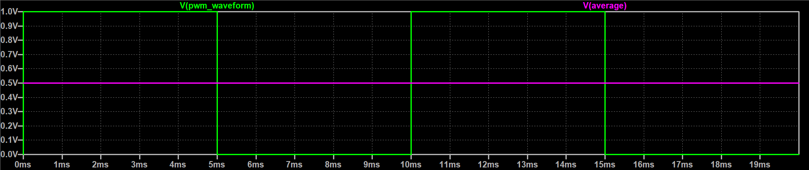
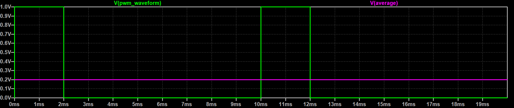
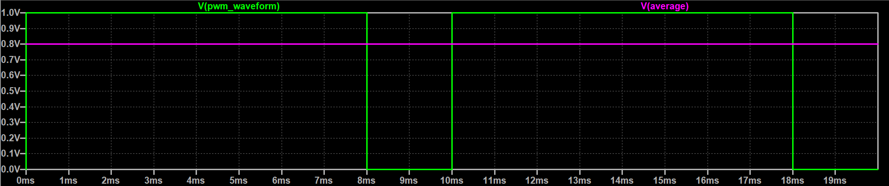
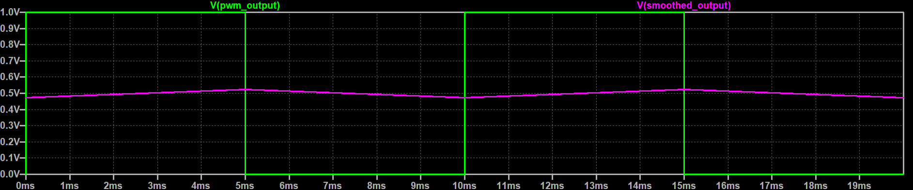
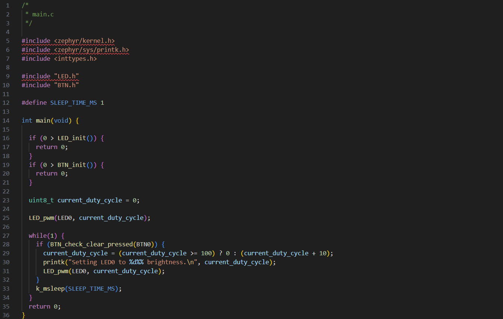

# Pulse Width Modulation (PWM)

## Table of contents
- [Pulse Width Modulation (PWM)](#pulse-width-modulation-pwm)
  - [Table of contents](#table-of-contents)
  - [Introduction](#introduction)
    - [Motivation](#motivation)
    - [How does it work?](#how-does-it-work)
    - [How will we be using it?](#how-will-we-be-using-it)
  - [Lesson](#lesson)
    - [Setup](#setup)
    - [New LED PWM API](#new-led-pwm-api)
    - [Example program](#example-program)
  - [Mini project](#mini-project)
    - [Specifications](#specifications)
    - [Instructions](#instructions)
    - [Tips](#tips)

## Introduction

This lesson will cover *Pulse Width Modulation*, which is usually abbreviated to *PWM*. PWM is a very
common technique used in embedded systems to emulate an analog output with only digital pins.

### Motivation

Computers are digital, but the world is analog. Because of this, embedded systems need to both
measure and produce analog signals with only digital circuitry at their disposal. Chips often
produce analog signals using digital to analog converters, but these are expensive in terms of
silicon area, power consumption and added hardware complexity. Enter pulse width modulation, a
technique to produce "analog" signals using a basic GPIO pin and a hardware timer. This is drastically
cheaper and is good enough in many applications!

### How does it work?

The definition of PWM is the method of sending a series of pulses where the width (the on-time) of
the pulses can be varied. The average voltage seen by the load is equal to the ratio of the pulse
width (pulse on-time) to the pulse period (pulse on-time + off-time), multiplied by the pulse amplitude.

$$
V_{avg} = \frac{T_{\text{width}}}{T_{\text{period}}} \times V_{\text{max}}
$$

The ratio of pulse width to pulse period expressed as a percentage is called the *duty cycle*

For example, if you send a series of 1V pulses with a 10ms period and a 5ms on-time, the average
voltage seen by the load will be 0.5V! The ratio of the pulse width to the pulse period is 5ms / 10ms, 
or 0.5 in this case, therefore the average voltage seen by the load is 0.5 * 1V or 0.5V (as seen below)  
  
This PWM setting has a duty cycle of 50 %

Take another example, let's reduce the pulse width to just 20% of the pulse's overall period. With
this setup, our average load voltage should be 2ms / 10ms * 1V or 0.2V:  
  
This PWM setting has a duty cycle of 20%

For one last example, let's increase the pulse width all the way to 80% of the pulse's overall
period. In this case, the average load voltage will be 8ms / 10ms * 1V or 0.8V!  
  
This PWM setting has a duty cycle of 80%

As you can see, we can vary the average voltage seen by the load just by varying how long the pulse
is on for! We can even add a capacitor to the output of the PWM to get a smoothed signal (a true analog signal), 
note that this isn't always done and can delay the response of the signal:  
  
Note: We will not be using a capacitor for our PWM LEDs

### How will we be using it?

Human eyes can only track changes happening as fast as ~30 Hz, and above that frequency (known as the 
flicker-fusion threshold) LED flashes fuse and can't be distinguished. This means that we can use PWM 
to vary how bright an LED appears. Think of our eyes as the capacitor in this case, and that their
inability to detect rapid changes "smoothes" the LED to look more or less bright.

Because we need to be well above the flicker-fusion threshold for the LED to appear smooth and not
flickering, PWM signals controlling LED brightness are usually between 50 - 100 Hz.

As an example, say we power an LED using a PWM signal with a duty cycle of 50%, the LED will appear to
be approximately half as bright as if we gave it full power. It's important to note that this doesn't
mean that the LED is actually on at half the brightness - the LED is turning fully on and fully off so
quickly that it only appears to be half as bright as our eyes blur the rapid changes.

It's important to note that PWM is used in many applications beyond simple LED brightness, for example:
- Servo motor control
- Voltage regulation
- Buzzer control

## Lesson

### Setup

1. Fetch the newest version of the EiE repo using `git fetch upstream main`
2. Go to your local copy of the main branch using `git checkout main`
3. Sync your local main branch with the EiE repo using `git pull upsream main`
4. Create a new branch for lesson 6 using `git checkout -b lesson-6`

### New LED PWM API

We've added a new API to the LED module that you can now use to turn on an LED at a given PWM duty cycle:  
`int LED_pwm(led_id led, uint8_t duty_cycle)`: sets the LED to the given duty cycle. Note that the duty_cycle
argument accepts values between 0 and 100. Returns 0 on success and a negative error code on failures. PWM uses
frequency of 50 Hz. The LED will continue running at the given duty cycle until changed again by another LED API call.

### Example program

Here is an example of how the LED PWM API should be used:  
  
You should recreate this and see what happens when you click BTN0 enough times for the LED to cycle through all 
brightnesses a few times. What do you notice about how much the brightness increases between 0 - 50% vs 50 - 100%?

## Mini project

This week's exercise is intended to pull together all of the content taught in EiE so far and is meant to
be a mini project. You might not finish the entire exercise during this week's session but you are encouraged
to try to finish it within the next 1-2 weeks. There are parts of this exercise where you'll be told to
collaborate, but you should do all other parts on your own to get the most out of this exercise.

### Specifications

Create a Finite State Machine (FSM) based program that follows all the following criteria:
- There should be a state where the board accepts input from BTN0 and BTN1 to enter an 8-bit ASCII
  code. The user should be able to click BTN2 to reset the bits already entered (in case they make
  a mistake), and they should be able to click BTN3 to save the ASCII code. LED0 and LED1 should blink
  when the corresponding button was clicked so the user knows their input has been detected.
  While in this state, LED3 should blink at 1 Hz.
- After a single ASCII code has been saved, the user should be able to:
  - Enter another ASCII code (so that they can create a string of characters that are saved into the program) 
    by using BTN0 and BTN1
  - Click BTN2 to delete the entire string they've entered so far and go back to the character entry state
  - Click BTN3 to save the entire string they've entered so far

  While in this state, LED3 should blink at 4 Hz.

- When the user decides to save the string they entered, they should be able to:
  - Click BTN2 to delete the string they entered and go back to the entry state
  - Click BTN3 to send it to the serial monitor

  While in this state, LED3 should blink at 16 Hz.

- At any point, the user should be able to hold down BTN0 and BTN1 for 3 seconds to go to a special "standby" state
  where all four LEDs gently pulse between fully off and fully on using PWM to vary brightness. The user
  should be able to click any button to exit this state and go back to whatever state they were just in.

### Instructions

1. Create a finite state machine transition diagram that captures all the above requirements, compare it
   with a friend and identify gaps/uncertainties in the specification provided. Try to address
   all possible behaviour in your state diagram. You can do the diagram in whatever way you are 
   most familiar (pencil + paper, tablet, plantuml etc)
   - Note: it's very common as an engineer to be given an incomplete or confusing specification,
     if there's a case that wasn't addressed in the specification above (there are several) it is up
     to you to make an assumption about what would be a reasonable outcome
2. Implement the state machine you've just designed
3. Test your project by going through each use case and make sure it follows the specifications, if it does, show
   it to a leader

### Tips

- Try to incorporate incremental design, this will make it easier to keep track of what has and hasn't
  been finished, and it will prevent you from getting intimidated by the bigger picture. It is recommended
  that you make a git commit after each logical step in your implementation.
- Use detailed printk statements throughout your code to make debugging easier

