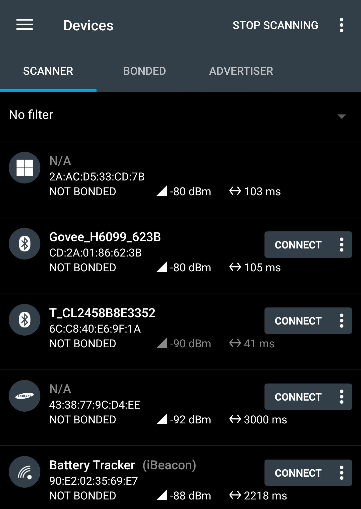
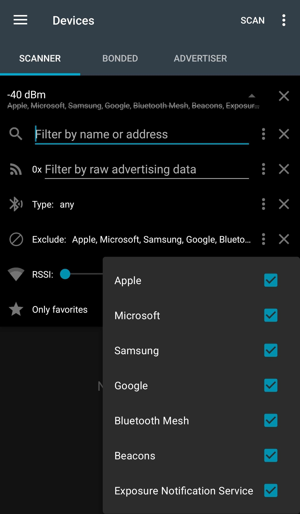
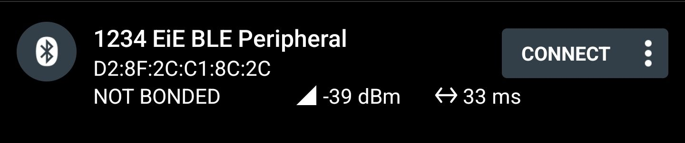
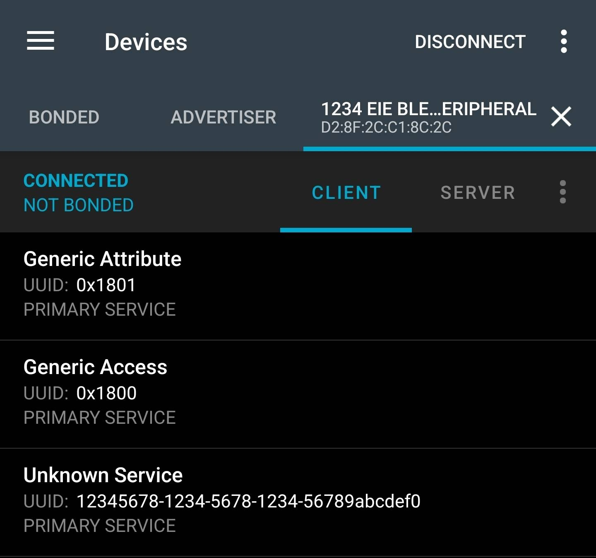
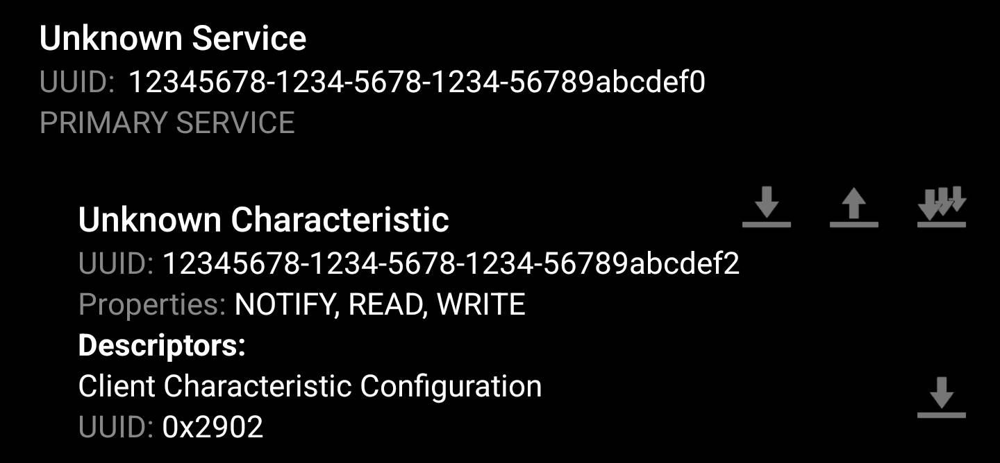

# BLE Intro

[TOC]

## Introduction

One of the most powerful things that computers can do is communicate information information between them.
Typically, this communication is done digitally,
where bits and bytes are encoded and sent across some physical media,
such as electrical conductors (wires, traces, etc.), optical fibres, or what we're going to be focussing on, RF (radio frequencies).
In this program, we will be using the BLE capabilities of the nRF52840DK board to wirelessly send and receive data with other devices.

## Motivation

At the embedded level,
wireless communication can be very helpful,
since a lot of embedded devices are very physically IO limited.
However, wireless communication is naturally a very power-hungry thing to do,
which can be an issue, since embedded devices are frequently power constrained,
usually being reliant on batteries that are intended to last for days, weeks, months, or even years at a time.

This is where Bluetooth Low Energy (BLE) comes in.
BLE provides a power-efficiency-focused,
standardized communication mechanism that is meant to be used by devices of all different uses,
regardless of the manufacturer.
There are a few other alternatives in the wireless communication space
(WiFi, Bluetooth Classic, ANT, Zigbee, etc.) that have different focuses,
but BLE provides an excellent base what we're doing.

## Lesson

### Explore the Basics of BLE

While we will be giving a brief introduction to the basics of BLE over the next few lessons,
a much more thorough introductory course has been made freely accessible by Nordic
(who make the radios and boards we're using):
<https://academy.nordicsemi.com/courses/bluetooth-low-energy-fundamentals/>

The above course covers a lot of content, so finishing it in one sitting is not practical,
especially in just a single EiE session.
For today, it will be worthwhile to only go over
[Lesson 1: Bluetooth LE Introduction](https://academy.nordicsemi.com/courses/bluetooth-low-energy-fundamentals/lessons/lesson-1-bluetooth-low-energy-introduction/).
The two main sections to focus on will be GAP ("Generic Access Profile") and GATT ("Generic Attribute Profile"),
which define how almost all BLE communication happens.

As for the rest of the lessons,
it would be useful to have the course open and peruse through it when you want more information on a specific topic. 

#### Goals

As a check to see if you're ready to move on, see if you can answer the following questions:

1. If device A searches for and connects to device B, which device must be *advertising*?
<!-- Answer: Device B must be advertising -->
2. In question 1, which device(s) are in the *central* role? Which device(s) are in the *peripheral* role?
<!-- Answer: Device A is the central, device B is the peripheral -->
3. Can a device be acting as both a *central* and a *peripheral*?
<!-- Answer: Yes -->
4. If a device is in the *central* GAP role, what GATT roles (*client*, *server*) can it act as? What about the *peripheral* GAP role?
<!-- Answer: A device can act as both a GATT client and server, regardless of its GAP role -->
5. If a device is transmitting bike speed information over BLE, would the field that actually contains the numeric speed value be a *service*, *characteristic*, or *attribute*?
<!-- Answer: Characteristics are the structures that actually contain data. Services are groups of these characteristics, and attributes are metadata surrounding how characteristics act. -->

Of course, this isn't graded, so this "quiz" is only for you to judge your own understanding.
Answers can be found in the source text for this file, so aren't visible in the rendered output that you're probably reading.
**BLE is a** ***very*** **large and complicated protocol, so don't be discouraged if this seems like a lot of information.**
**If you are ever confused, ask a leader!**
**We're here to help, and if you're confused, someone else likely is too, and we can provide more information where needed.**

### Install nRF Connect

If you have access to a smartphone,
install the "nRF Connect" app by Nordic Semiconductor.
If you are unable to do this, pair up with someone around you that can,
otherwise ask a leader for alternatives.

This app is contains a collection of tools that allows for real-time viewing, analysis, and interaction with any BLE peripheral in the area.
When opened, you should see a list of nearby BLE devices start populating,
along with their advertising address (6 hexadecimal bytes separated by colons),
signal strength ("RSSI", measured in dBm),
and advertising interval (time between received "advertising packets", measured in milliseconds).
Some devices will have a "Connect" button too.

Once you see this, you are ready to move on.

### Modify, Build, and Flash Example Code

The code in this repository is already setup to be a very basic BLE peripheral.
This uses a custom BLE service that has a single characteristic which can be ready from, written to, or send out notifications.
Let's modify, build, and flash this example to your board.
To do so, you must:

1. Open up a new Bash terminal and navigate to your `~/zephyr-projects` directory.
2. Activate your virtual environment with `source .venv/Scripts/activate` (Windows) or `source .venv/bin/activate` (Mac/Linux).
3. Navigate into your `eie_nrf52840.git` directory and **checkout the `lesson/ble_intro` branch!** (`git fetch upstream` then `git checkout lesson/ble_intro`)
4. Open VS Code via `code .`.
5. Open the `prj.conf` file and change the `CONFIG_BT_DEVICE_NAME` string to be `"#### EiE BLE Peripheral"`, where `####` is a number unique to you, like the last 4 digits of your UCID. This is important, since when everyone's devices start advertising, they'll all show up in your nRF Connect too!
6. Go back to your Bash terminal and build the project with `west build -p always -b nrf52840dk/nrf52840 app`
7. Plug in your dev board and flash it with `west flash`

If there were no error messages, you've flashed your board!
Now time to move on and connect with it via nRF Connect.

### Connect via nRF Connect

Once your board has been flashed with the BLE peripheral example code,
it is set to start advertising and become receptive to connections on startup.

1. Open up nRF Connect on your phone.
2. Expand the "Filter" field near the top,
   set the RSSI limit to -40 dBm (all the way to the left),
   and then tap the 3 dots on the "Exclude" field and check every box.
   These settings will make it easier to see only the boards near you.

3. Refresh the search by swiping down, just like you would a web page.

4. Hit the "Connect" button on your board's entry in order to connect to it.
   This should take you to a new tab with more details about your device.
5. Verify that you see "Generic Attribute", "Generic Access", and "Unknown Service" entries, like so:

6. Tap on "Unknown Service" (this is our custom service that is made by the example code).
   Ensure that you see a single "Unknown Characteristic" with the "READ", "WRITE", and "NOTIFY" properties,
   as well as three different arrow-based icons, like so:

7. Next to "Unknown Characteristic", tap the single-down-arrow icon to perform a *read*.
   This should read out 3 bytes, containing the string "EiE".
8. Next, tap the single-up-arrow icon to perform a *write*.
   This will pop up a menu where you can enter data to write to the characteristic.
   Change the drop-down from "BYTE ARRAY" to "TEXT (UTF-8)", type in a message to send, and hit "SEND".
   The board will then output the received string over the serial log,
   so make sure you have the serial monitor open and connected in VS Code!
9. Finally, Tap the multi-down-arrow icon to subscribe to *notifications*.
   This will show a new read value every time the board sends out a notification to that characteristic,
   which it is programmed to do with a counter that increments every second.

Note that there is no proper disconnect handling.
The board will connect to only the first device that tries, and only the first time.
For now, this prevents others from connecting to your board once you have already,
but we will make this more elegant in the future.
As a result, **you have to reset the dev board in order for a device to reconnect ove BLE**,
simply hit the reset button on the board or unplug it and plug it back in.

### Explore the Example Code

- Service description
  - `BT_GATT_SERVICE_DEFINE` is used for telling the radio how to define a single service
    - `BT_GATT_PRIMARY_SERVICE` sets the UUID for the service
    - `BT_GATT_CHARACTERISTIC` defines a single characteristic, along with its UUID, properties, permissions, and callbacks
      - You can add more `BT_GATT_CHARACTERISTIC` calls to the `BT_GATT_CHARACTERISTIC` arguments to add more characteristics to the service, but make sure the UUIDs are different for each characteristic!
    - `BT_GATT_CCC` adds a "client characteristic configuration" descriptor to the previous characteristic, which for us, simply allows for notifications to be subscribed to
- Read callback
  - `ble_custom_service_read` is called whenever a *connected device* tries to *read* from our characteristic
- Write callback
  - `ble_custom_service_write` is called whenever a *connected device* tries to *write* to our characteristic
- Notify function
  - `ble_custom_service_notify` can be called by *the dev board* in order to send out a notification to connected devices that are subscribed to our characteristic
  - Note that this is backwards from read/write!

- Main
  - BLE init
    - `bt_enable(NULL)` is called once to enable the BLE subsystem
      - `NULL` is passed as an argument to tell the subsystem to finish initialization before moving on, making this a *blocking* call
      - A callback could be passed here instead, which would let the code continue, and then the callback would only be called once the BLE init is done, making this an *asynchronous* call
    - `bt_le_adv_start(...)` is called after init, but before the main loop, to tell the radio to start advertising over BLE
      - `BT_LE_ADV_CONN_FAST_1` is a default set of parameters that tells the radio to use "connectable" advertising packets and transmit them frequently (we're not concerned about power usage here)
      - The remaining arguments tell the radio what data to put in the advertising packets, and in the "scan response" data (which can optionally be requested by a device before it connects)
  - Notify function called in main loop
    - `ble_custom_service_notify(&count, 4)` is called once per second in the main loop, notifying any connected devices that are subscribed to our custom characteristic with the value of a counter
      - Note that this notification is exactly that, just a notification, and does *not* change the underlying value of the data stored by the characteristic

## Challenge

If you have time before the end of the lesson and have completed the above,
give the following challenges a shot.
The purpose of the next lesson will be to get much more familiar with implementing your own custom service and characteristics,
so these will provide you a good head start:

1. Modify the supplied example so that if a connected device *writes* the string "LED ON" or "LED OFF" to the custom characteristic, LED 1 is set appropriately.

2. Add in a feature that reverses the direction of the *notify* counter every time BUTTON 1 is pressed.

3. Make it so that if a connected device *reads* from the custom characteristic, it outputs the current status of LED 1 ("ON" or "OFF") instead of the default "EiE".
